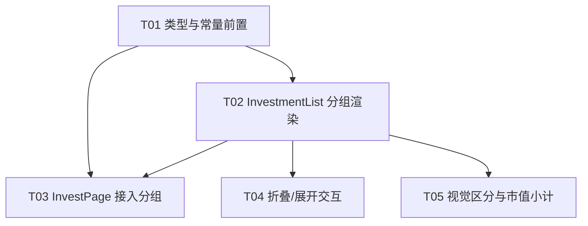

# 增量架构设计 · invest-v2 需求③：投资页按资产类别分组

> 文档类型：**增量设计**（仅描述本次变更，不重写整体设计）
> 模块：投资模块 v2 / 需求③ ｜ 架构师：高见远
> 关联需求：需求②（已完成：账户/持仓按金额降序）→ **本需求③** → 需求④（黄金识别+金价，产生 GOLD 数据）→ 需求⑤（定投）
> 结论基线：`docs/increment-prd-v2-3-grouping.md`（产品经理许清楚）、`docs/system_design.md`（既有 §1/§2/§3.1/§7.4 已规划分组顺序、可折叠、GOLD 枚举，本设计与之对齐）

---

## Part A：系统设计

### 1. 实现方案概述 + 框架选型

**技术基线不变**：Vite 5 + React 18 + MUI 5 + Tailwind 3 + Zustand + Dexie 4 + Recharts + Tesseract.js + axios + date-fns。**预计无新增依赖包**（见 §6）。

**难点与方案**：

| 难点 | 方案（复用点） |
|------|--------------|
| 平铺 → 分组，且须保留既有 `groupByAccount` / 平铺路径 | 沿用 `InvestmentList.renderGrouped()` 的分组写法，新增 `groupByCategory` 分支；三类路径（平铺 / 按账户 / 按类别）**口径隔离、互不污染** |
| CASH 既在投资列表被过滤、又需在分组以「现金（活期）」组展示 | 数据同源（完整 `investments` 含 CASH）；仅渲染分流：`visible`（过滤 CASH）用于平铺/按账户，`categoryGroups`（含 CASH）用于按类别 |
| 组头需 标题 + 条数徽标 + 市值小计 + 折叠交互 | 新建 `CategoryGroup` 子组件承载组头与折叠；排序/过滤仅在组件内 `useMemo` 完成，**零数据层改动** |
| 空组动态隐藏 + 组内 marketValue 降序 | `CATEGORY_GROUP_ORDER.map(filter→sort).filter(nonEmpty)`；排序口径复用 `visible` 的 `(b.marketValue)-(a.marketValue)` |

**架构模式**：延续 Repository + Service + Zustand Store + 组件分层。本次**仅**改动「类型层 + 常量层 + 组件层」，不涉及 `investmentRepository` / `investmentService` / `useInvestmentStore` 逻辑（`getSummary` 与账户余额口径**严守铁律，一律不改**）。

---

### 2. 文件清单（仅本次相关）

#### 新增文件

| 文件 | 职责 |
|------|------|
| `src/components/investment/CategoryGroup.tsx` | 单个资产类别组：组头（标题 + 条数徽标 + 市值小计 + chevron）+ 组内卡片列表；管理自身展开状态。 |

#### 修改文件

| 文件 | 修改内容 |
|------|--------|
| `src/types/index.ts` | `HoldingType` 枚举新增 `GOLD`；`Investment.holdingType` 注释更新为含 GOLD。 |
| `src/config/constants.ts` | 新增 `CATEGORY_GROUP_ORDER`、`HoldingTypeLabels`（含 CASH:'现金（活期）'）、`CATEGORY_COLORS`（GOLD 橙金 / CASH 灰）。 |
| `src/components/investment/InvestmentList.tsx` | 新增 `groupByCategory?: boolean`；新增 `categoryGroups` memo（按 `CATEGORY_GROUP_ORDER`、组内 `marketValue` 降序、空组隐藏）；新增 `renderCategoryGroup`；`groupByCategory` 为真走该路径，否则沿用现有 `visible` 逻辑（含 `groupByAccount`）。 |
| `src/components/investment/InvestmentCard.tsx` | 新增 `CASH` 分支（淡灰/简化视图，避免复用 FUND 的份额/净值展示）；`GOLD` 暂走 `WEALTH`-like 占位（黄金专属视图归需求④）。 |
| `src/pages/InvestPage.tsx` | 将 `<InvestmentList>` 传入 `groupByCategory`（替换默认平铺）；顶部「投资市值」卡片与 `summary` 不变。 |

---

### 3. 数据结构与接口设计

#### 3.1 HoldingType 扩展（`src/types/index.ts`）

```ts
/**
 * 持仓类型：公募基金 / 银行·平台理财 / 活期存款 / 黄金
 * - FUND：公募基金，有 fundCode/净值，可自动刷新
 * - WEALTH：理财产品，无公开净值，靠截图更新 marketValue + 收益字段
 * - CASH：活期存款，仅有 marketValue（活期金额），不计入投资市值
 * - GOLD：黄金（招行黄金等），shares 复用为「克重」；专属视图归需求④
 */
export enum HoldingType {
  FUND = 'FUND',
  WEALTH = 'WEALTH',
  CASH = 'CASH',
  GOLD = 'GOLD',   // 新增：黄金（招行黄金等），shares 复用为「克重」
}
```

> 注意：`HoldingType` 当前是**值枚举**，`import { HoldingType } from '../../types'` 即可作为类型与值同时使用。`constants.ts` 需 `import { HoldingType } from '../types'`（types 不反向依赖 constants，无循环）。

#### 3.2 常量新增（`src/config/constants.ts`）

```ts
import { HoldingType } from '../types';   // 文件顶部新增此 import

/** 资产类别分组固定顺序（投资列表分组、向导确认均按此序） */
export const CATEGORY_GROUP_ORDER: HoldingType[] = [
  HoldingType.FUND,
  HoldingType.WEALTH,
  HoldingType.GOLD,
  HoldingType.CASH,
];

/**
 * 持仓类型中文标签（卡片徽章 / 分组标题 / 表单 Toggle 统一引用）。
 * 注：CASH 标签取「现金（活期）」为分组标题专用，明确不计入投资市值；
 *     与既有 system_design §7.8 的 CASH:'现金' 不同，本次按需求③明文覆盖。
 */
export const HoldingTypeLabels: Record<HoldingType, string> = {
  FUND: '基金',
  WEALTH: '理财',
  GOLD: '黄金',
  CASH: '现金（活期）',
};

/** 分组视觉色（与 COLORS 对齐；GOLD 走黄金/橙金系，CASH 走中性灰非收益色） */
export const CATEGORY_COLORS: Partial<Record<HoldingType, string>> = {
  GOLD: '#FFB300',   // 琥珀金，呼应 COLORS.INVEST(#FF9800)
  CASH: '#9E9E9E',   // 中性灰，区别于投资类收益色
};
```

#### 3.3 InvestmentList 接口增量（`src/components/investment/InvestmentList.tsx`）

```ts
interface InvestmentListProps {
  investments: Investment[];
  accounts?: Account[];
  /** 是否按账户分组（既有，保留） */
  groupByAccount?: boolean;
  /** 是否按资产类别（基金/理财/黄金/现金）分组（新增） */
  groupByCategory?: boolean;
  onEdit?: (investment: Investment) => void;
  onDelete?: (investment: Investment) => void;
  onRefreshPrice?: (investment: Investment) => void;
}
```

核心分组 memo（组内排序口径与 `visible` 一致）：

```ts
// 按资产类别分组（含 CASH）：固定顺序 + 组内 marketValue 降序 + 空组隐藏
const categoryGroups = React.useMemo(
  () =>
    CATEGORY_GROUP_ORDER.map((type) => ({
      type,
      title: HoldingTypeLabels[type],
      items: investments
        .filter((inv) => inv.holdingType === type)
        .sort((a, b) => (b.marketValue ?? 0) - (a.marketValue ?? 0)),
    })).filter((g) => g.items.length > 0),
  [investments],
);
```

渲染分流（空判定按当前模式）：

```ts
if (groupByCategory) {
  if (categoryGroups.length === 0) return <EmptyState title="暂无投资持仓" .../>;
} else if (visible.length === 0) {
  return <EmptyState .../>;
}

return (
  <Box>
    {groupByCategory
      ? categoryGroups.map((g) => (
          <CategoryGroup key={g.type} type={g.type} title={g.title} items={g.items} renderCard={renderCard} />
        ))
      : groupByAccount
        ? renderGrouped()
        : visible.map(renderCard)}
    <Menu ...>{/* 既有 编辑/删除/刷新 菜单 */}</Menu>
  </Box>
);
```

#### 3.4 CategoryGroup 组件（`src/components/investment/CategoryGroup.tsx`，新建）

```ts
interface CategoryGroupProps {
  type: HoldingType;
  title: string;
  items: Investment[];
  renderCard: (inv: Investment) => React.ReactNode;
}
// 组头：标题 + 条数 Chip + 市值小计(formatCurrency Σ marketValue) + chevron
// 组内：items.map(renderCard)
// 展开状态：默认全部展开（useState(true)）；折叠态仍渲染组头（标题/条数/小计）
```

> T02 先实现「组头 + 卡片（默认展开、无 Collapse）」；T04 再包 MUI `Collapse` + chevron 切换；T05 再上现金组灰底/非收益色、黄金组橙金强调。

#### 3.5 InvestmentCard 增量（`src/components/investment/InvestmentCard.tsx`）

- 新增 `const isCash = investment.holdingType === HoldingType.CASH;`
- CASH 分支：不渲染「份额/成本价/当前净值」块（避免 0.00 噪声），仅展示 持有市值 + 「更新于」(若有)；整体淡灰、非收益色（与组内视觉一致，具体样式由 T05 完善）。
- `GOLD` 暂走 `WEALTH`-like 分支（`isWealth = holdingType === WEALTH || holdingType === GOLD`），黄金专属视图（克重/成本金价/最新金价）归需求④。

#### 3.6 类图（聚焦本次变更）

见 `docs/increment-v2-3-class.mermaid`。文字概述：

```
HoldingType(enum: FUND/WEALTH/CASH/GOLD)
InvestmentListProps --groupByCategory--> InvestmentList
InvestmentList --categoryGroups(useMemo)--> CATEGORY_GROUP_ORDER / HoldingTypeLabels (constants)
InvestmentList --renderCategoryGroup--> CategoryGroup
InvestmentList --renderCard--> InvestmentCard
CategoryGroup --renderCard--> InvestmentCard
InvestmentList ..> Investment (输入)
```

---

### 4. 关键流程时序图（groupByCategory 渲染）

见 `docs/increment-v2-3-sequence.mermaid`。文字概述：

1. `InvestPage` 挂载 → `useInvestment().fetchInvestments()`（Store 调 `investmentRepository.getAll()` 返回**含 CASH** 的全部持仓 + `getSummary()` 返回**不含 CASH** 的汇总）。
2. `InvestPage` 渲染 `<InvestmentList investments groupByCategory />`，顶部「投资市值」卡用 `summary.totalMarketValue`（不含 CASH，既定口径）。
3. `InvestmentList` 计算 `categoryGroups = CATEGORY_GROUP_ORDER.map(filter holdingType).sort(marketValue↓).filter(nonEmpty)`。
4. 每个非空组 → `<CategoryGroup>`：渲染组头（标题 + 条数 + Σ marketValue 小计）+ 组内 `renderCard` 每条 `InvestmentCard`。
5. 空组（无 GOLD / 无 CASH 数据）不渲染；现金组小计独立、不计入顶部投资市值。

> 顶部「投资市值」= 基金 + 理财 + 黄金 三组小计之和；现金组为独立流动性口径。

---

### 5. Anything UNCLEAR / 假设

1. **`HoldingTypeLabels.CASH` 取「现金（活期）」**：按 PRD/需求③明文，用于分组标题。该常量此前在 `constants.ts` 不存在，本次首次引入；已确认当前代码无其它模块定义同名常量（无冲突）。若未来表单 Toggle（需求④）希望用短标签「现金」，可另加 `HoldingTypeShortLabels`，本次不处理。
2. **折叠状态记忆（P2-2 / localStorage）**：本期不做，默认每次进入全展开；如要做归入后续迭代。
3. **组头「当日收益/持有收益」小计（P2-1）**：需 `getSummary` 分组口径支持，本期不做；当前组头仅「市值小计」。
4. **GOLD 数据来源**：由需求④（金价同步 / OCR）产生；本需求③仅承载分组，**无 GOLD 数据时黄金组整组隐藏**。GOLD 卡片暂复用 WEALTH-like 占位，专属视图归需求④。
5. **`groupByAccount` 与 `groupByCategory` 互斥**：均由父层 `InvestPage` 二选一传入，不叠加；本次仅启用 `groupByCategory`。
6. **口径铁律**：账户总金额 = `account.balance`（已含 CASH 活期持仓市值，由 `recalcBalanceFromHoldings` 保证），严禁 balance 与持仓相加；`getSummary` 与账户口径本次一律不改。

---

## Part B：任务分解

### 6. 依赖包增量

**无新增依赖包。** 全部复用现有栈：

- UI：复用 `@mui/material`（`Collapse` / `Chip` / `IconButton` / `Box` 均在其中）+ `@mui/icons-material`（`ExpandMore` 等）。
- 状态/存储/工具：复用 `zustand`、`dexie`、`date-fns`、`React.useMemo/useState`。
- 本次不改动 repository / service / store，**无需任何新依赖**。

---

### 7. 共享知识（跨文件约定，工程师必读）

1. **CASH 不计入顶部「投资市值」**：顶部卡片用 `summary`（`getSummary()` 已 skip CASH）；现金组小计**独立展示，绝不加回** `summary`。基金 + 理财 + 黄金 三组小计之和 = 顶部「投资市值」；现金组为流动性口径。
2. **空组动态隐藏**：`categoryGroups` 仅保留 `items.length > 0` 的组；无 GOLD / 无 CASH 数据时不渲染对应组头（无残留空块）。
3. **组内 `marketValue` 降序**：排序口径复用 `InvestmentList.visible` 的 `(b.marketValue ?? 0) - (a.marketValue ?? 0)`，与需求②一致。
4. **两条渲染路径口径隔离**：`groupByCategory` 基于**完整** `investments`（含 CASH）；`groupByAccount` / 平铺路径沿用 `visible`（过滤 CASH）。两者互不改写对方数据。
5. **账户总金额铁律（沿用 system_design §7）**：`balance` 与持仓不相加；CASH 已作持仓落库。本次不改 `getSummary` / 账户口径。
6. **GOLD 卡片占位**：本期 GOLD 走 `WEALTH`-like 视图；黄金专属（克重/金价）归需求④。无 GOLD 数据时整组隐藏。
7. **折叠默认全部展开**：折叠态仍显示 标题 / 条数 / 小计，仅内容收起（P1-1）。
8. **`HoldingTypeLabels` 统一引用**：分组标题、卡片徽章、未来表单 Toggle 统一从此取；`CASH` = 「现金（活期）」（覆盖既有 system_design §7.8 的「现金」）。

---

### 8. 任务列表（有序，按实现顺序，含依赖 + 验收）

> 遵循硬性上限：**共 5 个任务**。T01 为前置（类型/常量基础设施）；T02/T03 依赖 T01；T04/T05 依赖 T02 且**相互独立、可并行**。

#### T01　类型与常量前置（P0）
- **涉及文件**：`src/types/index.ts`、`src/config/constants.ts`
- **内容**：
  1. `HoldingType` 加 `GOLD`；`Investment.holdingType` 注释更新为含 GOLD。
  2. `constants.ts` 顶部新增 `import { HoldingType } from '../types'`。
  3. 新增 `CATEGORY_GROUP_ORDER = [FUND, WEALTH, GOLD, CASH]`、`HoldingTypeLabels`（含 `CASH:'现金（活期）'`）、`CATEGORY_COLORS`（`GOLD:'#FFB300'`、`CASH:'#9E9E9E'`）。
- **依赖**：无
- **验收**：`tsc`/`npm run build` 通过；`HoldingType.GOLD` 与 `CATEGORY_GROUP_ORDER` / `HoldingTypeLabels` 可被其它模块引用且无循环依赖。

#### T02　InvestmentList 分组渲染（P0）
- **涉及文件**：`src/components/investment/InvestmentList.tsx`、`src/components/investment/CategoryGroup.tsx`（新建）、`src/components/investment/InvestmentCard.tsx`
- **内容**：
  1. `InvestmentList` 新增 `groupByCategory?: boolean`；新增 `categoryGroups` memo（按 `CATEGORY_GROUP_ORDER`、组内 `marketValue` 降序、空组隐藏）；新增 `renderCategoryGroup` 走 `<CategoryGroup>`；渲染分流（见 §3.3）。
  2. 新建 `CategoryGroup.tsx`：组头（标题 + 条数 Chip + 市值小计 `formatCurrency(Σ marketValue)`）+ 组内 `renderCard`；默认展开（无 Collapse 暂由 T04 补）；空组不渲染。
  3. `InvestmentCard` 新增 `CASH` 分支（淡灰/简化，不显示份额/净值）；`GOLD` 暂走 `WEALTH`-like 占位。
- **依赖**：T01
- **验收**：投资页（传 `groupByCategory`）按 基金→理财→黄金→现金 顺序分组；空组隐藏；组内按市值降序；组头含 标题+条数+小计；CASH 卡片不显示份额/净值。

#### T03　InvestPage 接入 groupByCategory（P0）
- **涉及文件**：`src/pages/InvestPage.tsx`
- **内容**：
  1. 「持仓列表」区块 `<InvestmentList>` 传入 `groupByCategory`（替换默认平铺）；移除未启用的 `groupByAccount` 传参（保持互斥）。
  2. 顶部「投资市值」卡片与 `summary` **不变**（仍不含 CASH）。
  3. 空状态与加载态沿用既有逻辑（仅分组路径的空判定见 T02）。
- **依赖**：T01、T02
- **验收**：进入投资页默认即「按类别分组」视图；顶部投资市值不变（不含现金）；无数据时空状态正常。

#### T04　分组折叠/展开交互（P1）
- **涉及文件**：`src/components/investment/CategoryGroup.tsx`
- **内容**：
  1. 组内卡片列表包 MUI `Collapse`（`in={expanded}`，`timeout="auto"`，`unmountOnExit`）。
  2. 组头右侧加 `IconButton` + `ExpandMore` chevron；点击整组头 `setExpanded(v=>!v)` 切换；chevron 旋转动画。
  3. 默认 `expanded=true`（全部展开）；**折叠态仍显示 标题/条数/小计**（仅内容收起）。
- **依赖**：T02
- **验收**：点击组头可收起/展开；折叠后组头信息完整；再次点击恢复；默认首屏全展开。

#### T05　视觉区分与市值小计（P1）
- **涉及文件**：`src/components/investment/CategoryGroup.tsx`、`src/components/investment/InvestmentCard.tsx`
- **内容**：
  1. 现金组视觉区分：组头 `bgcolor: 'action.hover'`（淡灰底）、标题/小计用 `text.secondary` 非收益色；明确「现金（活期）」不计入投资市值。
  2. 黄金组标题用 `CATEGORY_COLORS.GOLD` 橙金强调（数据到达后自动出现）。
  3. `InvestmentCard` CASH 卡片整体淡灰、非收益色样式收口，与组内视觉一致。
- **依赖**：T02
- **验收**：现金组与基金/理财/黄金组视觉可区分（灰底/非收益色）；黄金组橙金强调；市值小计清晰。

---

### 9. 任务依赖图

见 `docs/increment-v2-3-task-graph.mermaid`（同下文字概述）：



- T01 是根依赖（类型/常量）。
- T02 在 T01 后；T03 依赖 T01+T02。
- T04、T05 均在 T02 后、**相互独立、可并行**（仅改 `CategoryGroup` / `InvestmentCard` 样式与交互，不影响彼此）。
