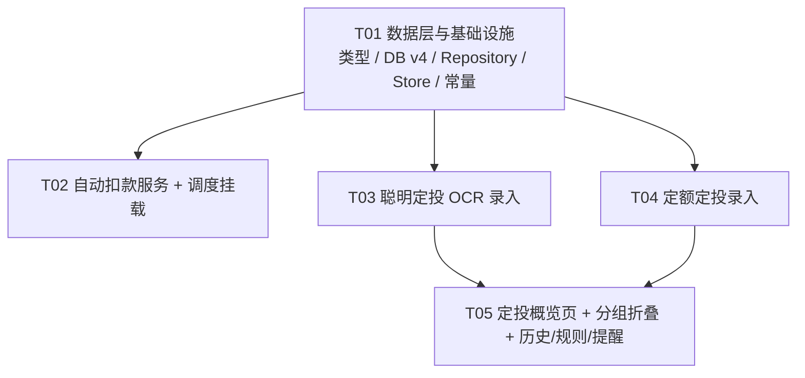

# 增量架构设计 · invest-v2 需求⑤：基金定投计划（DCA Plan）

> 文档类型：**增量设计**（仅描述本次变更，不重写整体设计）
> 模块：投资模块 v2 / 需求⑤ ｜ 架构师：高见远
> 关联需求：需求③（已完成：投资页按资产类别分组 FUND/WEALTH/GOLD/CASH）→ **本需求⑤（定投）** → 后续 P2（动态扣款/止盈/图表）
> 结论基线：`docs/increment-prd-v2-5-dca.md`（产品经理许清楚）、`docs/increment-design-v2-3-grouping.md`（既有③设计，本设计与之视觉/分层对齐）、`docs/system_design.md`（账户余额铁律 §7）

---

## Part A：系统设计

### 1. 实现方案概述 + 框架选型

**技术基线不变**：Vite 5 + React 18 + MUI 5 + Tailwind 3 + Zustand + Dexie 4 + Recharts + Tesseract.js + date-fns。**预计无新增依赖包**（见 §6）。

**难点与方案**（增量最小变更原则，复用既有机制）：

| 难点 | 方案（复用点，已核实代码真实路径） |
|------|-----------------------------------|
| 新增两个实体且 DB 需升级 v3→v4 | 沿用 `src/db/database.ts` 的 `version(n).stores(...).upgrade()` 写法；v4 重新声明**全部**既有表 + 新增 `dcaPlans`/`dcaRecords`；upgrade 闭包为空（仅建表，零数据丢失、幂等）。 |
| 自动扣款必须改 FUND 持仓市值并联动账户余额 | **严禁新增余额计算逻辑**。复用 `accountRepository.recalcBalanceFromHoldings(accountId)`（真实签名 `src/db/repositories/accountRepository.ts:133`）。新增 `investmentRepository.applyDcaContribution(id, amount)` 直接对 `marketValue/costAmount` 各 `+amount`（holdingProfit 口径不变），随后调 `recalcBalanceFromHoldings`。 |
| 自动扣款触发（PWA 无后台） | 在 `App.tsx` 顶层 `useEffect` 挂 `useDcaScheduler`：挂载即跑一次（APP 启动）+ 监听 `visibilitychange`/`focus`（前台化）再跑；扫 `enabled && nextDeductionDate<=今日` 的计划。 |
| 聪明定投 OCR 解析 | 新建 `src/services/dcaOcrParser.ts`，**复用既有真实导出** `normalizeOcrText` / `parseCnyAmount`（来自 `src/services/wealthOcrParser.ts`，PRD 文档里的 `normalizeOcrAmount` 不存在，以代码为准）。 |
| 概览分组折叠视觉一致性 | 新建 `DcaPlanGroup` 严格对齐需求③ `CategoryGroup`：`Collapse` + `ExpandMore` chevron + 条数 `Chip` + 小计；组头用 `COLORS.INVEST(#FF9800)` 强调。 |
| 目标 FUND 持仓定位歧义 | `DcaPlan` 新增 `targetInvestmentId`（FK→Investment），建档时即绑定既有/新建的 FUND 持仓；`fundCode/fundName` 仅作展示与兜底匹配，避免扣款时多持仓歧义。 |

**架构模式**：延续 Repository + Service + Zustand Store + 组件分层。本次新增 `dcaRepository` / `dcaService` / `useDcaStore` / `useDcaScheduler`，复用 `investmentRepository`、`accountRepository`、`wealthOcrParser` 与 `Investment`/`Account` 实体；**账户余额铁律一律不改**（余额 = Σ持仓市值，绝不 balance 与持仓相加）。

---

### 2. 文件清单（仅本次相关）

#### 新增文件

| 文件 | 职责 |
|------|------|
| `src/types/dca.ts` | `DcaPlan`/`DcaRecord` 接口 + `DcaPlanType`/`DcaFrequency`/`DcaDeductionMode` 枚举 + `CreateDcaPlanDTO`/`DcaOcrParseResult`/`DcaDeductionResult` 类型。 |
| `src/db/repositories/dcaRepository.ts` | `DcaPlanRepository`：`dcaPlans`/`dcaRecords` 两表的 CRUD、`getEnabledDuePlans(today)`、`getRecordsByPlan(planId)`。 |
| `src/services/dcaOcrParser.ts` | `parseDcaOcrText(text)` + `toDcaPrefill(result)`：复用 `normalizeOcrText`/`parseCnyAmount` 解析定投截图。 |
| `src/services/dcaService.ts` | `DcaService.savePlan(dto)`（解析/创建目标 FUND 持仓并落库）+ `runDueDeductions(today)`（核心调度逻辑）。 |
| `src/store/useDcaStore.ts` | `useDcaStore`（P1-5）：plan/record 增删改查 + `runDueDeductions()` + `lastDeductions`（提醒源）。 |
| `src/hooks/useDcaScheduler.ts` | `useDcaScheduler()`：APP 启动/前台触发 `useDcaStore.runDueDeductions()`。 |
| `src/components/dca/DcaOcrButton.tsx` | 拍照/截图 OCR 按钮（对齐 `InvestmentOcrButton`，回调 `DcaOcrParseResult`）。 |
| `src/components/dca/DcaSmartEntry.tsx` | 聪明定投录入页：上传→OCR 预填（可手改）→账户/标的→（P1-1 规则卡）→保存 type=SMART。 |
| `src/components/dca/DcaFixedEntry.tsx` | 定额定投录入页：标的（下拉 FUND 或手填）→金额→频度→首扣日→保存 type=FIXED。 |
| `src/components/dca/DcaPlanGroup.tsx` | 按 `type` 分组的折叠容器（对齐 `CategoryGroup`）。 |
| `src/components/dca/DcaPlanCard.tsx` | 单计划卡片：基金名/金额/频度/下一扣款日/启停 Switch/累计投入(P1-4)/点击编辑。 |
| `src/components/dca/DeductionRuleCard.tsx` | P1-1 扣款率规则表（静态展示，默认折叠）。 |
| `src/components/dca/DcaRecordList.tsx` | P1-2 某计划扣款历史列表（日期/金额/标的）。 |
| `src/pages/DcaOverviewPage.tsx` | 定投计划概览页（路由 `/invest/dca`）：两分组 + FAB 新建 + 空态 + 提醒中心(P1-3)。 |

#### 修改文件

| 文件 | 修改内容 |
|------|--------|
| `src/types/index.ts` | 末尾 `export * from './dca'` 汇出新增类型（类型集中放在 `types/dca.ts`，`index.ts` 仅 re-export，避免大文件膨胀）。 |
| `src/db/database.ts` | 类内新增 `dcaPlans!`/`dcaRecords!` 两张 `Table` 声明；新增 `version(4).stores({...全部表 + 两新表})`（upgrade 闭包为空）。 |
| `src/db/repositories/investmentRepository.ts` | 新增 `applyDcaContribution(id: string, amount: number): Promise<void>`（marketValue/costAmount 各 +amount → `recalcBalanceFromHoldings`）。 |
| `src/config/constants.ts` | 新增 `DcaPlanTypeLabels`/`DcaFrequencyLabels`/`DcaDeductionModeLabels`/`DEDUCTION_RULE_TABLE`（P1-1 静态文案）/`ROUTES.DCA`。 |
| `src/App.tsx` | 新增路由 `/invest/dca` → `DcaOverviewPage`；顶层挂 `<DcaScheduler/>`（运行 `useDcaScheduler` + 渲染提醒 Snackbar）。 |
| `src/pages/InvestPage.tsx` | 顶部增加「我的定投计划 →」入口卡片/按钮，`navigate(ROUTES.DCA)`（不新增底部 Tab，保持 5 Tab 布局不变）。 |

---

### 3. 数据结构与接口设计（类图见 `docs/increment-v2-5-class.mermaid`）

#### 3.1 新增枚举（`src/types/dca.ts`）

```ts
export enum DcaPlanType { SMART = 'SMART', FIXED = 'FIXED' }
export enum DcaFrequency { DAILY = 'DAILY', WEEKLY = 'WEEKLY', MONTHLY = 'MONTHLY' }
export enum DcaDeductionMode { AUTO = 'AUTO', MANUAL_CONFIRM = 'MANUAL_CONFIRM' }
```

#### 3.2 DcaPlan（`src/types/dca.ts`）

```ts
export interface DcaPlan {
  id: string;                       // PK
  type: DcaPlanType;                // SMART | FIXED
  accountId: string;                // FK → Account.id（目标持仓归属账户）
  targetInvestmentId: string;       // FK → Investment.id（目标 FUND 持仓，扣款落点；建档时确定）
  fundCode: string;                 // 冗余展示 + 兜底匹配（手填/无 targetInvestmentId 时按 accountId+fundCode 找）
  fundName: string;                 // 冗余展示
  amount: number;                   // 本期扣款额（元）；SMART 即「基准金额」
  frequency: DcaFrequency;          // DAILY | WEEKLY | MONTHLY
  nextDeductionDate: string;        // ISO 日期 'YYYY-MM-DD'
  enabled: boolean;
  deductionMode: DcaDeductionMode;  // 默认 'AUTO'（Q1 假设）
  // —— SMART 可选字段 ——
  benchmarkIndex?: string;          // 对标指数
  benchmarkMa?: string;             // 对标均线
  investedPeriods?: number;         // 已投期数
  deductionRule?: string;           // 扣款规则说明（仅展示）
  createdAt: string;
  updatedAt: string;
}
```

#### 3.3 DcaRecord（`src/types/dca.ts`）

```ts
export interface DcaRecord {
  id: string;                       // PK
  planId: string;                   // FK → DcaPlan.id
  accountId: string;                // FK（建档时快照）
  targetInvestmentId: string;       // FK（建档时快照）
  fundCode: string;
  fundName: string;
  amount: number;                   // 实际扣款额（元）
  deductedAt: string;               // ISO 时间戳
  basisDate: string;                // ISO 日期：该记录对应的扣款日（= 当次 nextDeductionDate）
}
```

#### 3.4 关键接口签名

**`investmentRepository.applyDcaContribution`（修改 `src/db/repositories/investmentRepository.ts`）**

```ts
/**
 * 定投扣款：向目标持仓注入金额。市值与成本同步 +amount，holdingProfit 口径不变。
 * 必须走此方法而非通用 update()——通用 update() 会按 FUND 公式 marketValue=shares*currentPrice 重算并覆盖手动增量。
 * 写入后调用 recalcBalanceFromHoldings 复用既有余额口径（不新增余额计算）。
 */
async applyDcaContribution(investmentId: string, amount: number): Promise<void>;
```

**`DcaPlanRepository`（新增 `src/db/repositories/dcaRepository.ts`）**

```ts
class DcaPlanRepository {
  getAllPlans(): Promise<DcaPlan[]>;
  getPlan(id: string): Promise<DcaPlan | undefined>;
  createPlan(dto: CreateDcaPlanDTO): Promise<DcaPlan>;
  updatePlan(id: string, dto: Partial<CreateDcaPlanDTO>): Promise<void>;
  deletePlan(id: string): Promise<void>;                 // 级联删除其 dcaRecords
  getEnabledDuePlans(today: string): Promise<DcaPlan[]>; // enabled && nextDeductionDate <= today
  createRecord(dto: Omit<DcaRecord,'id'>): Promise<DcaRecord>;
  getRecordsByPlan(planId: string): Promise<DcaRecord[]>;
}
```

**`DcaService`（新增 `src/services/dcaService.ts`）**

```ts
class DcaService {
  savePlan(dto: CreateDcaPlanDTO): Promise<DcaPlan>;      // 解析/创建目标 FUND 持仓 → 写 DcaPlan
  runDueDeductions(today?: string): Promise<DcaDeductionResult[]>;
  private rollNextDeductionDate(dateISO: string, freq: DcaFrequency): string; // date-fns addDays/addWeeks/addMonths
}
```

**`useDcaStore`（新增 `src/store/useDcaStore.ts`，对齐 `useInvestmentStore` 模式）**

```ts
interface DcaStore {
  plans: DcaPlan[];
  records: DcaRecord[];
  loading: boolean;
  error: string | null;
  lastDeductions: DcaDeductionResult[];   // 提醒源（App 据此弹 Snackbar）
  fetchPlans(): Promise<void>;
  createPlan(dto: CreateDcaPlanDTO): Promise<void>;
  updatePlan(id: string, dto: Partial<CreateDcaPlanDTO>): Promise<void>;
  deletePlan(id: string): Promise<void>;
  fetchRecords(planId?: string): Promise<void>;
  runDueDeductions(): Promise<void>;       // 调 dcaService.runDueDeductions → 写 lastDeductions + 联动 useInvestmentStore/useAccountStore 刷新
}
```

---

### 4. 程序调用流程（自动扣款端到端，时序图见 `docs/increment-v2-5-sequence.mermaid`）

1. `App` 挂载 → `<DcaScheduler/>` 调 `useDcaScheduler()`：立即 `runDueDeductions()`（APP 启动），并 `addEventListener('visibilitychange'/'focus')` 在 `document.visibilityState==='visible'` 时再跑（前台化）。
2. `useDcaStore.runDueDeductions()` → `dcaService.runDueDeductions(today)`（`today` 取本地日期 `YYYY-MM-DD`）。
3. `dcaService` 调 `dcaRepository.getEnabledDuePlans(today)` → 返回 `enabled && nextDeductionDate <= today` 的计划。
4. 对每个到期计划（**仅补记一次**，见 Q4）：
   - 若 `deductionMode==='MANUAL_CONFIRM'`：仅收集进「待确认」列表，不写记录（本期默认 AUTO，该分支为后续预留）。
   - 否则（AUTO）：写 `DcaRecord{planId, accountId, targetInvestmentId, amount, basisDate=nextDeductionDate}` → 调 `investmentRepository.applyDcaContribution(targetId, amount)`（`marketValue/costAmount` 各 +amount）→ 内部调 `accountRepository.recalcBalanceFromHoldings(accountId)`（余额 = Σ持仓市值，严格不相加）→ `rollNextDeductionDate` 前滚到下一未逾期日 → `dcaRepository.updatePlan(nextDeductionDate=rolled, investedPeriods+1)`。
5. `dcaService` 返回 `DcaDeductionResult[]`；`useDcaStore` 写入 `lastDeductions`、刷新 `plans/records`，并联动 `useInvestmentStore.fetchInvestments()` + `useAccountStore.fetchAccounts()` 让投资/账户视图即时反映。
6. `App` 依据 `lastDeductions` 渲染 Snackbar：「X 基金 定投 ¥amount 已记录」。

> **余额铁律（沿用 system_design §7）**：`recalcBalanceFromHoldings` 是唯一余额写入点；扣款只改持仓 `marketValue`，余额由它重算，严禁 `balance += amount` 式自增。

---

### 5. Anything UNCLEAR / 设计决策（含待明确事项）

1. **`targetInvestmentId` 为我方新增字段**：PRD P0-1 字段表未列，但 `Investment ||--o{ DcaPlan` 已隐含 FK。为避免扣款时按 `fundCode` 命中多个 FUND 持仓的歧义，建档时即绑定目标持仓 id（下拉选中既有持仓则用之；手填 code+name 则先 `investmentRepository.create(FUND)` 再绑其 id）。`fundCode/fundName` 保留为展示+兜底。
2. **`applyDcaContribution` 直接改 `marketValue/costAmount` 而非改 `shares`**：FUND 通用 `update()` 会按 `shares*currentPrice` 重算并覆盖手动增量，故必须走专用方法；`holdingProfit = marketValue - costAmount` 因两者同增而口径不变（符合 PRD「holdingProfit 口径不变」）。
3. **Q1 自动扣款语义**：默认 `deductionMode='AUTO'`（本地自动入账，不碰真实资金）；`MANUAL_CONFIRM` 分支已预留但不实现提醒外逻辑。
4. **Q3 扣款额**：本期固定用 `amount`（SMART=基准金额），不做规则缩放（P2-1）。
5. **Q4 补扣**：多日未开也只写**一条** `DcaRecord`（对应原 `nextDeductionDate`），随后 `nextDeductionDate` 前滚到首个 `>= today` 的日期；不重复补多期。
6. **Q2 OCR 截图来源**：真实样本未验证，解析器按多别名尽力匹配；**任一字段未识别则留空，用户必须手改确认**后保存（兜底策略）。
7. **路由入口**：底部导航为固定 5 Tab，不新增 Tab；在 `InvestPage` 顶部加「我的定投计划 →」入口跳 `/invest/dca`，保持增量最小变更。
8. **账户余额铁律**：沿用既有口径，本次任何改动都不新增余额计算逻辑。

---

## Part B：任务分解

### 6. 依赖包增量

**无新增依赖包。** 全部复用现有栈：

- UI：复用 `@mui/material`（`Collapse`/`Chip`/`Switch`/`IconButton`/`Fab`/`Snackbar` 等）+ `@mui/icons-material`（`ExpandMore`/`Add`/`TrendingUp`）。
- 状态/存储/工具：复用 `zustand`、`dexie`、`date-fns`（`addDays`/`addWeeks`/`addMonths`/`format`/`parseISO`，已在 `utils/format.ts` 使用）、`Tesseract.js`（已在 `ocrService` 使用）。
- OCR：复用 `src/services/wealthOcrParser.ts` 的真实导出 `normalizeOcrText` / `parseCnyAmount`（非 PRD 文档中误写的 `normalizeOcrAmount`）。
- 本次不改动 `recalcBalanceFromHoldings` / 账户余额口径，**无需任何新依赖**。

---

### 7. 共享知识（跨文件约定，工程师必读）

1. **金额单位**：一律「元」（`number`，2 位小数），与 `marketValue`/`balance` 一致；展示用 `formatCurrency()`。
2. **日期格式**：`nextDeductionDate` / `basisDate` 为 ISO 日期字符串 `'YYYY-MM-DD'`；`deductedAt`/`createdAt`/`updatedAt` 为 ISO 时间戳。解析/格式化统一用 `date-fns`（`parseISO`/`format`/zhCN），**不要用 `new Date().toLocaleDateString()` 拼字符串**。
3. **DB 升级幂等写法**：`version(4).stores()` 必须**完整重声明全部表**（accounts/transactions/categories/investments/platformMappings/budgets + dcaPlans/dcaRecords）；upgrade 闭包留空（仅建表，不迁移老数据，零丢失、幂等）。不要在 v4 里省略既有表，否则会被删除。
4. **`deductionMode` 默认 `'AUTO'`**：新建计划时 `deductionMode` 默认 `DcaDeductionMode.AUTO`。
5. **余额铁律（最高优先级）**：扣款只通过 `investmentRepository.applyDcaContribution` → `recalcBalanceFromHoldings(accountId)` 联动余额；**任何位置都禁止 `balance += amount` 式自增**；`balance` 与持仓市值绝不相加。
6. **OCR 字段 → DcaPlan 字段映射表**（由 `dcaOcrParser.toDcaPrefill` 实现）：

   | OCR 识别锚点（多别名） | → DcaPlan 字段 | 解析工具 |
   |------------------------|----------------|----------|
   | 基准金额 / 定投金额 / 每期扣款 | `amount`（基准金额） | `parseCnyAmount` |
   | 对标指数 / 跟踪指数 / 指数 | `benchmarkIndex` | 关键词就近文本 |
   | 对标均线 / 250日均线 / MA | `benchmarkMa` | 关键词就近文本 |
   | 扣款间隔 / 定投周期 / 频率 | `frequency`（DAILY/WEEKLY/MONTHLY 归一） | 关键词映射 |
   | 下一扣款日 / 下次扣款 | `nextDeductionDate` | 日期正则 `'YYYY-MM-DD'` |
   | 已投期数 / 已投期数 | `investedPeriods` | 整数解析 |

   任一字段未识别 → `undefined`/`''`，表单留空并高亮提示手填。
7. **视觉一致性（对齐需求③）**：分组折叠严格复用 `CategoryGroup` 模式（`Collapse` + `ExpandMore` 旋转 + 条数 `Chip` + 小计 `formatCurrency`）；DCA 主色用 `COLORS.INVEST(#FF9800)`；卡片单列移动布局、空态有引导按钮。
8. **`targetInvestmentId` 是扣款落点**：任何读持仓的逻辑优先用 `targetInvestmentId`；仅当其为空时用 `accountId+fundCode` 兜底查找（不推荐）。
9. **Store 命名/联动惯例**：`useDcaStore` 仿 `useInvestmentStore`；`createPlan/updatePlan/runDueDeductions` 后联动 `useAccountStore.fetchAccounts()` 与 `useInvestmentStore.fetchInvestments()` 刷新依赖视图。

---

### 8. 任务列表（有序，按实现顺序，含依赖 + 验收）

> 遵循硬性上限：**共 5 个任务**。T01 为数据层与基础设施根任务（类型/DB/Repository/Store/常量）；T02/T03/T04 均仅依赖 T01（可并行）；T05 依赖 T01+T03+T04（概览聚合两个录入页 + 调度提醒）。

#### T01　数据层与基础设施（P0-1 / P0-7 / P1-5）
- **负责角色**：工程师
- **涉及文件**：`src/types/dca.ts`（新增）、`src/types/index.ts`（re-export）、`src/db/database.ts`、`src/db/repositories/dcaRepository.ts`（新增）、`src/db/repositories/investmentRepository.ts`、`src/store/useDcaStore.ts`（新增）、`src/config/constants.ts`
- **内容**：
  1. 新增 `types/dca.ts`：枚举 `DcaPlanType`/`DcaFrequency`/`DcaDeductionMode`、`DcaPlan`/`DcaRecord` 接口、`CreateDcaPlanDTO`/`DcaOcrParseResult`/`DcaDeductionResult`；`index.ts` `export * from './dca'`。
  2. `database.ts`：类内声明 `dcaPlans!`/`dcaRecords!`；`version(4).stores({...全部表..., dcaPlans:'id,accountId,fundCode,type,nextDeductionDate', dcaRecords:'id,planId,accountId,basisDate'})`，upgrade 闭包为空。
  3. 新增 `dcaRepository.ts`：`DcaPlanRepository` 全套 CRUD + `getEnabledDuePlans(today)` + `getRecordsByPlan(planId)`，单例 `dcaRepository`。
  4. `investmentRepository.ts` 新增 `applyDcaContribution(id, amount)`（marketValue/costAmount 各 +amount → `recalcBalanceFromHoldings`）。
  5. 新增 `useDcaStore.ts`（P1-5）：plan/record 增删改查 + `runDueDeductions()` + `lastDeductions`，联动账户/投资 Store。
  6. `constants.ts`：新增 `DcaPlanTypeLabels`/`DcaFrequencyLabels`/`DcaDeductionModeLabels`/`DEDUCTION_RULE_TABLE`/`ROUTES.DCA`。
- **依赖**：无
- **验收**：`tsc`/`npm run build` 通过；v3→v4 升级零数据丢失、两新表可写；`useDcaStore` 的 CRUD 与 `runDueDeductions` 可调用；`applyDcaContribution` 使 FUND `marketValue`/`costAmount` 各 +amount 且 `recalcBalanceFromHoldings` 被触发。

#### T02　自动扣款服务 + 调度挂载（P0-6）
- **负责角色**：工程师
- **涉及文件**：`src/services/dcaService.ts`（新增）、`src/hooks/useDcaScheduler.ts`（新增）、`src/App.tsx`
- **内容**：
  1. 新增 `dcaService.ts`：`savePlan(dto)`（解析/创建目标 FUND 持仓并落库 DcaPlan）、`runDueDeductions(today)`（扫到期计划→写 DcaRecord→`applyDcaContribution`→`recalcBalanceFromHoldings`→`rollNextDeductionDate` 前滚→`updatePlan`）→ 返回 `DcaDeductionResult[]`；`rollNextDeductionDate` 用 `date-fns` 按频度前滚（多日未开只补记一次）。
  2. 新增 `useDcaScheduler.ts`：`useEffect` 挂载即跑 `runDueDeductions()` + 监听 `visibilitychange`/`focus` 前台复跑。
  3. `App.tsx`：顶层挂 `<DcaScheduler/>`（运行 scheduler + 读取 `useDcaStore.lastDeductions` 渲染提醒 Snackbar）；新增路由 `/invest/dca`。
- **依赖**：T01
- **验收**：APP 启动/切回前台，到期 enabled 计划自动生成 `DcaRecord`、目标 FUND `marketValue` 与账户 `balance` 同步增长（余额 = Σ持仓市值，无重复相加）；`nextDeductionDate` 正确前滚；扣款后弹出 Snackbar「X 基金 定投 ¥amount 已记录」；多日未开仅补记一条。

#### T03　聪明定投 OCR 录入（P0-2 / P0-3）
- **负责角色**：工程师
- **涉及文件**：`src/services/dcaOcrParser.ts`（新增）、`src/components/dca/DcaOcrButton.tsx`（新增）、`src/components/dca/DcaSmartEntry.tsx`（新增）
- **内容**：
  1. 新增 `dcaOcrParser.ts`：`parseDcaOcrText(text)` 复用 `normalizeOcrText`/`parseCnyAmount` 解析 ①基准金额②对标指数③对标均线④扣款间隔⑤下一扣款日⑥已投期数；`toDcaPrefill(result)` 映射为 `Partial<CreateDcaPlanDTO>`；未识别字段留空。
  2. 新增 `DcaOcrButton.tsx`：对齐 `InvestmentOcrButton`，调 `ocrService.recognize` + `parseDcaOcrText`，回调 `(prefill, matched)`。
  3. 新增 `DcaSmartEntry.tsx`：上传/拍照→OCR 预填（展示「原值灰/识别值」对比、可逐字段手改）→ 选账户+标的（下拉 FUND 或手填 code+name，手填时建档并绑 `targetInvestmentId`）→（P1-1 `DeductionRuleCard`）→ 保存 `type=SMART`（调 `useDcaStore.createPlan`）。
- **依赖**：T01
- **验收**：上传定投截图→OCR 预填六项字段；任意字段可手改；保存生成 `DcaPlan(type=SMART, targetInvestmentId 已绑定)`；未识别字段高亮提示必填。

#### T04　定额定投录入（P0-4）
- **负责角色**：工程师
- **涉及文件**：`src/components/dca/DcaFixedEntry.tsx`（新增）
- **内容**：
  1. 新增 `DcaFixedEntry.tsx`：选标的（下拉既有 FUND 持仓 → 取 id 绑 `targetInvestmentId`；或手填 fundCode+fundName → 建档后绑 id）→ 填 `amount`(>0) → 频度单选（每天/每周/每月）→ 首扣日 `nextDeductionDate`（日期选择器）→ 保存 `type=FIXED`（调 `useDcaStore.createPlan`）。校验：金额>0、频度必选、标的必选。
- **依赖**：T01
- **验收**：保存生成 `DcaPlan(type=FIXED, targetInvestmentId 已绑定)`；校验不通过给出提示；与 T03 共用 `useDcaStore.createPlan` 的建档逻辑。

#### T05　定投概览页 + 分组折叠 + 历史/规则/提醒（P0-5 / P1-1 / P1-2 / P1-3 / P1-4）
- **负责角色**：工程师
- **涉及文件**：`src/pages/DcaOverviewPage.tsx`（新增）、`src/components/dca/DcaPlanGroup.tsx`（新增）、`src/components/dca/DcaPlanCard.tsx`（新增）、`src/components/dca/DeductionRuleCard.tsx`（新增，P1-1）、`src/components/dca/DcaRecordList.tsx`（新增，P1-2）、`src/App.tsx`（路由，T02 已加）、`src/pages/InvestPage.tsx`（入口按钮）、`src/config/constants.ts`（ROUTES.DCA，T01 已加）
- **内容**：
  1. 新增 `DcaPlanGroup.tsx`：按 `type` 分「聪明定投」「定额定投」两组，对齐 `CategoryGroup`（组头=标题+条数 Chip+下期扣款合计小计+`ExpandMore` 折叠，默认展开，空组隐藏）。
  2. 新增 `DcaPlanCard.tsx`：基金名 + 金额 + 频度 + 下一扣款日 + 启用 `Switch`（调 `updatePlan`）+ 累计投入(P1-4 = Σ本计划 DcaRecord.amount)+ 点击进编辑（复用 T03/T04 录入组件）。
  3. 新增 `DcaOverviewPage.tsx`：两分组渲染 + FAB 新建（弹层选 聪明/定额，分别走 T03/T04）+ 空态引导；P1-3 提醒中心聚合 `lastDeductions`（待执行/已执行，可点进计划）。
  4. 新增 `DeductionRuleCard.tsx`（P1-1）：静态扣款率规则表，`Collapse` 默认折叠，仅展示不计算。
  5. 新增 `DcaRecordList.tsx`（P1-2）：计划详情展示 `DcaRecord`（日期/金额/标的）。
  6. `InvestPage.tsx`：顶部加「我的定投计划 →」入口 `navigate(ROUTES.DCA)`。
- **依赖**：T01、T03、T04（入口与录入组件就绪；T02 调度提醒已全局生效）
- **验收**：`/invest/dca` 按 聪明/定额 两组可折叠展示；卡片含 基金/金额/频度/下一扣款日/启停/累计投入；FAB 可建两类计划；空态有引导；规则卡(P1-1)、扣款历史(P1-2)、提醒中心(P1-3) 可达；从投资页可进入概览。

---

### 9. 任务依赖图（见 `docs/increment-v2-5-task-graph.mermaid`）



- T01 是根依赖（数据层/基础设施），其余任务均在其后。
- T02/T03/T04 仅依赖 T01，**相互独立、可并行**（自动扣款、聪明录入、定额录入三块解耦）。
- T05 聚合 T03/T04 的录入组件与 T01 的 Store，并消费 T02 的全局提醒；为唯一末端任务。

---

### 附录：P2 后续规划（本期不实现）

| ID | 内容 | 备注 |
|----|------|------|
| P2-1 | 聪明定投按规则动态扣款 | 依赖指数/均线取数（Q2 延伸），扣款额 = 基准金额 × 规则比例 |
| P2-2 | 止盈/暂停策略 | 收益达阈值自动暂停计划 |
| P2-3 | 定投盈亏图表 | DcaRecord 序列绘制成本均线 vs 持仓市值（Recharts） |
| P2-4 | 手动「立即扣款」 | 允许临时手动触发一次扣款（不依赖日期） |
