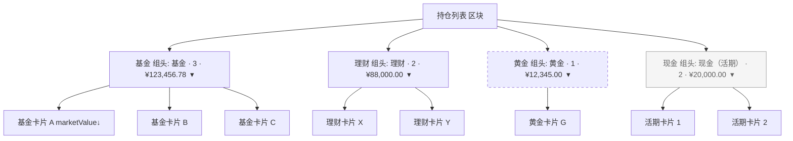

# 增量 PRD · invest-v2 需求③：投资页按资产类别分组

> 文档类型：**增量 PRD**（仅描述本次变更，不重写整体 PRD）
> 模块：投资模块 v2 / 需求③ ｜ 产品经理：许清楚
> 技术栈：Vite5 + React18 + MUI5 + Tailwind3 + Zustand + Dexie4(IndexedDB) + Recharts + Tesseract.js（纯前端 PWA，无后端）
> 关联：需求②（已完成：账户/持仓按金额降序）→ **本需求③** → 需求④（黄金识别+金价，产生 GOLD 数据）→ 需求⑤（定投计划）

---

## 0. 范围与依赖（动手前代码确认）

基于实际代码阅读（`src/` 下）确认的现状：

| 现状项 | 代码位置 | 结论 |
|--------|----------|------|
| `InvestmentList` 已有 `groupByAccount` 属性，但 `InvestPage` 未传 true（当前平铺渲染） | `InvestmentList.tsx:27,36` / `InvestPage.tsx:200` | 复用其分组写法新增 `groupByCategory` |
| `visible` 过滤 CASH 且按 `marketValue` 降序 | `InvestmentList.tsx:51-57` | 组内排序口径已就绪，直接沿用 |
| `getSummary()` 显式跳过 CASH（`if (inv.holdingType === CASH) continue`） | `investmentRepository.ts:336` | 顶部「投资市值」不含 CASH（既定口径，本次不改） |
| `getAll()` 返回含 CASH 的全部持仓 | `investmentRepository.ts:37-40` | 分组路径可直接用完整 `investments` |
| `HoldingType` 当前仅 FUND/WEALTH/CASH，无 GOLD | `types/index.ts:43-47` | 需 T01 新增 `GOLD` 枚举 |
| `CATEGORY_GROUP_ORDER` / `HoldingTypeLabels` 尚未定义 | `config/constants.ts` | 需 T01 提供（本 PRD 前置依赖） |

**前置依赖（T01，假设已具备）**：`HoldingType.GOLD='GOLD'` 枚举、`CATEGORY_GROUP_ORDER=[FUND,WEALTH,GOLD,CASH]` 常量、`HoldingTypeLabels={FUND:'基金',WEALTH:'理财',GOLD:'黄金',CASH:'现金'}` 常量。

**本次变更不触碰**：账户总金额口径、`getSummary` 口径、`recalcBalanceFromHoldings`（严守「balance 与持仓不相加」铁律）。

---

## 1. 产品目标（Product Goals）

| # | 目标 | 说明 |
|---|------|------|
| G1 | 资产结构一目了然 | 投资页持仓按资产类别（基金/理财/黄金/现金）分组，用户快速看清各类别规模 |
| G2 | 组内决策高效 | 每组内持仓沿用市值降序，用户快速定位大头持仓 |
| G3 | 零口径冲突 | 分组展示与顶部「投资市值」及账户余额口径严格一致，杜绝 CASH 双算/误解 |

---

## 2. 用户故事（User Stories）

| # | 角色 | 诉求 | 价值 |
|---|------|------|------|
| US1 | 投资者 | 作为投资者，我希望持仓按「基金/理财/黄金/现金」分组展示，以便快速了解资产结构 | 降低信息扫读成本 |
| US2 | 投资者 | 作为投资者，我希望每组显示「条数 + 市值小计」，以便掌握每类资产规模 | 支持大类层面决策 |
| US3 | 投资者 | 作为投资者，我希望组内按市值降序且可折叠/展开，以便聚焦重点持仓 | 提升长列表可用性 |
| US4 | 投资者 | 作为投资者，我希望现金（活期）单独成组但明确不属于投资市值，以便区分「投资」与「流动性」 | 避免与顶部投资市值混淆 |

---

## 3. 需求池（仅本次变更）

优先级：P0 必须有 / P1 应该有 / P2 锦上添花

### P0（Must have）
| ID | 需求 | 验收标准 |
|----|------|----------|
| P0-1 | `InvestmentList` 新增 `groupByCategory` 模式，按 `CATEGORY_GROUP_ORDER` 顺序分组渲染 | 渲染顺序恒为 FUND→WEALTH→GOLD→CASH |
| P0-2 | 每组头部展示：类别标题、该组持仓条数、该组 `marketValue` 合计小计 | 小计 = Σ(组内每条 marketValue) |
| P0-3 | 组内持仓按 `marketValue` 降序（沿用 `visible` 排序逻辑） | 同组多持仓时大额在上 |
| P0-4 | `InvestPage`「持仓列表」区块切换为 `groupByCategory`（替换原平铺渲染） | 页面默认进入即分组视图 |
| P0-5 | 空组动态隐藏（无 GOLD 数据不显示黄金组；无 CASH 不显示现金组） | 无残留空占位块 |
| P0-6 | 依赖 T01 落地 `GOLD` 枚举 / `CATEGORY_GROUP_ORDER` / `HoldingTypeLabels` | 类型与常量编译通过 |

### P1（Should have）
| ID | 需求 | 验收标准 |
|----|------|----------|
| P1-1 | 分组折叠/展开交互（MUI `Collapse`），默认全部展开；折叠态仍显示条数+小计 | 点击组头可收起/展开 |
| P1-2 | 现金组标题标注「现金（活期）」并做视觉区分（淡灰底/非收益色），明确不计入投资市值 | 与基金/理财/黄金视觉可区分 |

### P2（Nice to have）
| ID | 需求 | 验收标准 |
|----|------|----------|
| P2-1 | 组头增加该组「当日收益/持有收益」小计（需 getSummary 分组口径支持） | 可选增强 |
| P2-2 | 记忆用户折叠状态（会话级或 localStorage） | 刷新后保持 |

---

## 4. UI 设计稿（分组布局）

### 4.1 布局结构（Mermaid）

> 虚线框（黄金）：需求④产生 GOLD 数据后出现；无数据时整组隐藏。
> 灰底框（现金）：流动性口径，不计入顶部「投资市值」；无 CASH 持仓时隐藏。

### 4.2 组头构成（每组统一）

| 区域 | 内容 | 说明 |
|------|------|------|
| 左侧 | 类别标题（`HoldingTypeLabels`）+ 条数徽标 | 如「基金 · 3」 |
| 右侧 | 市值小计（`formatCurrency(Σ marketValue)`）+ chevron 折叠按钮 | 默认展开 ▾ |
| 交互 | 点击整行切换 `Collapse` | 折叠后仍显示标题/条数/小计 |

### 4.3 各组数据口径

| 组 | holdingType | 标题(label) | 组内排序 | 空组处理 | 小计口径 |
|----|-------------|-------------|----------|----------|----------|
| 基金 | FUND | 基金 | marketValue↓ | 隐藏 | Σ marketValue |
| 理财 | WEALTH | 理财 | marketValue↓ | 隐藏 | Σ marketValue |
| 黄金 | GOLD | 黄金 | marketValue↓ | 隐藏（需求④数据到达后自动出现） | Σ marketValue |
| 现金 | CASH | 现金（活期） | marketValue↓ | 隐藏 | Σ marketValue（**不计入顶部投资市值**） |

---

## 5. 五个待明确问题的决策结论

| # | 问题 | 结论 | 理由 |
|---|------|------|------|
| Q1 | 是否新增 `HoldingType.GOLD='GOLD'`？无 GOLD 数据时空组预留还是动态隐藏？ | **① 新增 GOLD 枚举；② 空组动态隐藏（不预留空占位）** | ① 与需求④对齐（系统设计 §3.1/T01 已规划），分组常量需引用；② 避免「黄金(0) ¥0」空块，顺序常量仍保证多组时顺序正确 |
| Q2 | 分组固定顺序是否为 基金→理财→黄金→现金？ | **是，固定顺序 = FUND→WEALTH→GOLD→CASH** | 由 `CATEGORY_GROUP_ORDER` 常量驱动（系统设计 §7.4 已拍板） |
| Q3 | 组内排序是否沿用②的市值降序？ | **是，组内按 marketValue 降序** | 与现有 `InvestmentList.visible` 排序及需求②一致，无歧义 |
| Q4 | CASH（活期）是否作为「现金」组纳入本次分组？ | **是，纳入为「现金（活期）」组（存在 CASH 持仓时展示，无则隐藏）** | 需求③正文明确将现金列为第 4 组；CASH 已以持仓形式落库（`recalcBalanceFromHoldings`）可直接用；系统设计中「默认隐藏」被本需求明文覆盖 |
| Q5 | 是否需要分组折叠/展开？默认全部展开？ | **是，支持折叠/展开（MUI Collapse），默认全部展开** | 系统设计 §1/§2/§3.1 已规划「可折叠」；T04 验收含可折叠；默认展开保证首屏信息完整 |

### Q4 一致性处理（重要）
- 顶部「投资市值」卡片按 `getSummary()` 既定口径**不含 CASH**（代码 `investmentRepository.ts:336` 跳过 CASH）。
- 因此：**基金 + 理财 + 黄金 三组小计之和 = 顶部「投资市值」**；现金组小计为独立流动性口径，**不计入投资市值**。
- 为杜绝用户误将现金小计计入投资市值，现金组标题标注「现金（活期）」、采用淡灰底/非收益色视觉区分（P1-2）。
- **不改 `getSummary` 口径、不改账户总金额口径**（严守「balance 与持仓不相加」铁律）。

---

## 6. 范围边界 / Open Questions

1. **黄金卡片视觉**（克重/成本金价/最新金价/市值）属需求④（T04），本 PRD 仅负责分组承载。当前 GOLD 卡片会走 `InvestmentCard` 既有 WEALTH-like 分支（占位可接受），待需求④增强为黄金专属视图。
2. **顶部「投资市值」卡片是否随本次改为含现金？** → 结论：**不改**，保持 `getSummary` 不含 CASH 的既定口径；现金组作为独立流动性展示。
3. **`groupByAccount`（按账户分组）模式去留**：本次新增 `groupByCategory`，`groupByAccount` 仍保留（当前 InvestPage 未启用）；后续若需「按账户 + 按类别」双维度可另议，不在本需求范围。

---

## 7. 技术变更清单（聚焦本次）

| 文件 | 变更 |
|------|------|
| `src/components/investment/InvestmentList.tsx` | 新增 `groupByCategory?: boolean`；新增按 `CATEGORY_GROUP_ORDER` 的分组渲染函数（动态隐藏空组、组内 marketValue 降序、组头含 标题/条数/市值小计/折叠开关）；`groupByCategory` 为真时走该路径，否则沿用现有 `visible` 逻辑（保持需求②行为不变）。注：`groupByCategory` 路径基于完整 `investments`（含 CASH），`groupByAccount`/非分组路径沿用 `visible`（过滤 CASH） |
| `src/pages/InvestPage.tsx` | 将 `<InvestmentList>` 传入 `groupByCategory`（替换默认平铺） |
| `src/types/index.ts` / `src/config/constants.ts` | 由 T01 提供 `GOLD` 枚举、`CATEGORY_GROUP_ORDER`、`HoldingTypeLabels`（前置，非本 PRD 修改） |
